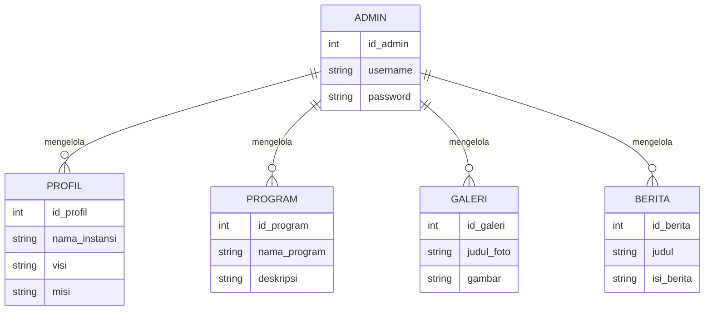

# Perancangan CMS Profil Sekolah

## Deskripsi Sistem

CMS Profil Sekolah adalah sistem yang digunakan untuk mengelola informasi sekolah seperti profil, berita, galeri, fasilitas, dan data lainnya melalui halaman admin.

## Struktur Menu

- Dashboard
- Profil Sekolah
- Program
- Berita
- Galeri
- Fasilitas
- Prestasi
- Guru/Dosen
- PPDB
- Kontak
- Testimoni

## ERD

